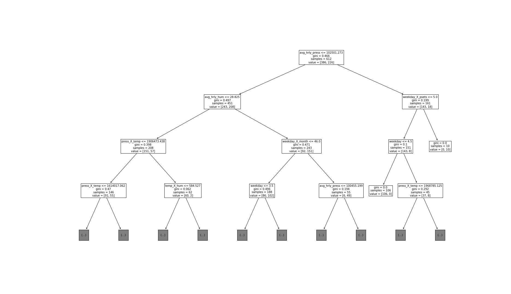

# AC209a Final Project 

##### Kyra Ballard, Kaela Nelson, Lauren Baker

We completed project A: measuring our environment. For this project, we collected data from two sensors placed inside residences. 

## Datasets 

We collected our data using sensors that capture their surrounding features: light (cadmium sulfide photoresistor AFEC), motion (passive infrared detector with 150 cm over 100 degree range; records binary 0 or 1 pulses with 2sec resolution), temperature (-20 to 60 degrees C), humidity (20 to 95% RH with resolution 0.1%), and pressure (300 - 1100 hPa +/-1 hPa). We placed Sensor 1 in the foyer of one student's apartment, and Sensor 2 in the bedroom of another student's apartment (both students in this group). The differences in these locations are as follows: Sensor 1 is placed in an apartment with multiple residency and building-regulated heat, and Sensor 2 is placed in an apartment with single residency and tenant-regulated heat.

For each sample and corresponding sensor, we specified both the sample and duration rates, as recorded below. Our intuition behind this is that light and motion tend to fluctuate more frequently, so we set their sample rate to collect within smaller windows of time. However, temperature, humidity, and pressure fluctuate less frequently over a small time interval, so we set their sample rate to be higher (note that these environmental variables were recorded via one sensing "head" of the sensor and thus required the same sampling frequency). The duration of our data collections lasted between 24-99 hours (99 hour limit). Details on collection rates are included below.

### Sensor 1 

Location: Apartment 1 foyer

* Light:
    * Sample rate: 5 min
    * Duration Rate: 24-72 hours
* Motion:
    * Sample rate: 1 sec
    * Duration Rate: 24-72 hours
* Temperature/Pressure/Humidity:
    * Sample rate: 10 min 
    * Duration Rate: 24-72 hours  
    * Note: The first three collections used a sample rate of 30 min to have more data points, as the team originally thought that the building-regulated temperature, rather than tenant-regulated temperature, could be an interesting variable to investigate.

### Sensor 2

Location: Apartment 2 bedroom

* Light:
    * Sample rate: 5 min
    * Duration Rate: 99 hours
* Motion:
    * Sample rate: 1 sec
    * Duration Rate: 99 hours
* Temperature/Pressure/Humidity:
    * Sample rate: 30 min
    * Duration Rate: 99 hours

Note: Sensor 2 utilized the maximum duration of recording (99 hours), while Sensor 1 used variable durations due to more frequent collection troubles (needed to perform shorter collections to confirm data was indeed recording). Because there were complications on some of the sample collections, our data has some missing values from some dates in between some collection times. We dealt with this by omitting these sample collections from our data set. We included a separate section with detailed Sensor 1 issues at the end of this report.

## Preliminary Data Analysis (Sensor 1, Milestone 3)

Each sensor stores the data as separate files for each feature in an SD card that we then uploaded and saved on our computers. These files were saved as text files, so we wrote functions that read in these text files and created a data frame of each feature. In addition, when we collected the data, we recorded each sample's start date and time. Based on this, we developed a method to create a pandas date time object of the collection start date, and then interpolated more dates to match our collection sample frequency for each feature. Lastly, to handle missing values for this milestone, we omitted any samples that failed to record. Thus, our data set only includes data for times that the sensor actually recorded. We decided not to use interpolation for missing data as the patterns of data are very variable and the duration of missing data is very long (not confident in the accuracy of the interpolated data). 

Initial data visualizations for Milestone 3 indicated that Sensor 1 had the most interesting trend in light, where we could see a pattern of when natural light fills the apartment.

After analyzing this plot, we decided that it would be interesting to look at the average amount of light per hour over the collection sample period. We then overlaid this average light over a plot of light during all collection days.

As you can see above, we can infer that sunrise occurs around 5 am and sunset occurs around 5pm. It is even more interesting to see that after sunset, we could potentially classify artificial versus natural light, because if light is less than 4095 after sunset, then it would have to be artificial light. This motivated us to adjust our research question to be based on predicting artificial or natural light. Thus, our newly revised project question is: **"Based on indoor environmental features, is the light that the sensor catches artificial or natural?"** In addition, we are interested in features are most indicative of the light is artificial or natural. 

### Decision Tree 

We decided to fit a simple decision tree model to our training data because our outcome variable has 3 categories: light off, natural light, and artificial light, and and it would not make sense to perform a linear or logistic regression. For this model, we created a baseline data set with the following features:

* Light
* Day: day of the month
* Hour: hour of the day (0-23)
* Light_on: 
    * 0 if light is off (determined by if Light = max(Light))
    * 1 if light is on (determined by if Light < max(Light))
* Light_source:
    * 0 if light is on and it is artificial
    * 1 if light is on and it is natural
    * 2 if light is off

From these variables, we have that light, day, hour, and light_on are our predictor variables and light_source is our outcome variable that we wish to predict. To determine the best tree depth, we chose a range of tree depths from 1 to 5 and evaluated the performance and standard deviations for each depth using 5-fold cross-validation. We plotted the estimated cross val mean +/- 2 standard deviations for each depth, along with the train and test scores. 

After analyzing the results from the above plot, we found that a tree depth of 2 returned the highest accuracy score (without overfitting to 100%). We then fit a simple decision tree with a tree depth of 2, based on this plot and get the following results:

* Decision Tree of Depth 2, Accuracy of Training Set: 94.95%
* Decision Tree of Depth 2, Accuracy of Testing Set: 94.47%

These high accuracy scores would be expected in this case because we have a limited number of predictors and the data already seems to have some kind of trend/pattern to it (i.e. change in light over time of day).

### Application of Light Classification Model

Predicting whether light is artificial, natural or off could be useful for the development of a lamp/house lighting that emits a natural pattern of light throughout the day to mirror natural light in a given space and match a user's light needs in that space. Additionally, quantifying and classifying light may be of interest in the real estate business, as having rooms with certain durations and intensities of light may be of interest to potential buyers.

### Sensor 1 Issues

Sensor 1 experienced several collection issues since sensor distribution in mid October. Please see the section at the end of this report with detailed descriptions and plots of the issues below. Unfortunately the most recent empty collection/data issues presented themselves right before Thanksgiving break and were not able to be resolved due to staff holiday. Based on all of these data issues from Sensor 1 following the Milestone 3, we decided to proceed with exploring Sensor 2 data for the remainder of this project. Sensor 2 did not experience any data collection trouble for the duration of the project. 

## Sensor 2 Data Exploration and Modeling

Purely for visualization purposes, we inverted our light so that 0 represents light off and 4095 represents light on (by subtracting every value by 4095). We then scaled light by a factor of 10 to overlay it with motion count. We also scaled pressure by a factor of 10000 to overlay it. We group each variable by hour and then visualized according to week day (Monday through Sunday).  We see the results below.

The hourly fluctuation in light and motion visually line up well, while temp/press/hum are close to constant throughout day and across days. Notice that there is no light when there is no motion, hinting at some kind of correlation in this case and supporting that motion-sensing lighting may be beneficial (i.e. if person in sensor 2's apartment forgets to turn off the lights and the sensor doesn't detect any motion, it will turn the light off and save her electric bill!). Interestingly, we noticed from these plots that Sensor 2 recorded lights on (i.e. resident was awake) past midnight on days that corresponded to problem set due dates. We therefore decided to integrate the number of problem sets due per day as a variable in our dataset. This variable was generated by counting the number of problem sets due for a given day for the team member with Sensor 2 in her apartment. Similarly, in addition to investigating how the number of problem sets may relate to lights being on (or lights being on later for days when they are due), we were also interested in understanding how this may relate to the number of hours of sleep that this individual had. Specifically, we were interested in utilizing the Fitbit sleep tracking data from the team member with Sensor 2 to understand whether we can use environmental data from the sensor in addition to the number of problems sets due to predict whether this individual had a "good sleep," i.e. greater than 7 hours or a "bad sleep," i.e. less than 7 hours.

The hourly fluctuation in light and motion visually line up well, while temp/press/hum are close to constant throughout day and across days. Notice that there is no light when there is no motion, hinting at some kind of correlation in this case and supporting that motion-sensing lighting may be beneficial (i.e. if person in sensor 2's apartment forgets to turn off the lights and the sensor doesn't detect any motion, it will turn the light off and save her electric bill!). Interestingly, we noticed from these plots that Sensor 2 recorded lights on (i.e. resident was awake) past midnight on days that corresponded to problem set due dates. We therefore decided to integrate the number of problem sets due per day as a variable in our dataset. This variable was generated by counting the number of problem sets due for a given day for the team member with Sensor 2 in her apartment. Similarly, in addition to investigating how the number of problem sets may relate to lights being on (or lights being on later for days when they are due), we were also interested in understanding how this may relate to the number of hours of sleep that this individual had. Specifically, we were interested in utilizing the Fitbit sleep tracking data from the team member with Sensor 2 to understand whether we can use environmental data from the sensor in addition to the number of problems sets due to predict whether this individual had a "good sleep," i.e. greater than 7 hours or a "bad sleep," i.e. less than 7 hours.

For further analysis, we also calculated the average values for the following predictors based on weekday (0-6 corresponds to Monday - Sunday). 

 Notice here how average light, temperature and humidity remain relatively constant through out the week, whereas more motion occurs towards the end of the week compared to the beginning/middle. This would make sense, as temperature is set a a specified temperature and doesn't fluctuate until it is manually set differently. The motion count is higher during the weekends because the person in sensor 2's apartment is most likely at class or working on psets outside of the apartment during the week, but goes home to do work on the weekends. Lastly, notice that the most psets are typically due on day 2 of the week, or Wednesday. As a result, the person in this apartment on average, gets the most amount of sleep on the night prior to Thursday, after the psets are due. 
 

## Predicting Quality of Sleep

We generated a scatter matrix to visualize any existing correlations in our data. We also used this plot to inform the creation of interaction and polynomial terms to augment our dataset.

 

Notice that from this scatter matrix, we can see that there is a more distinct correlation between temperature and humidity. 

### Variables

Outcome variable = sleep score, i.e. quality of sleep indicator 
* number of hours slept during each night was recorded from Fitbit of team member with Sensor 2 in apartment
* data was assigned 1 if greater than 7 hours ("good sleep") or 0 if less than 7 hours ("less than recommended amount of sleep")

Our Predictor variables consist of the following data:

Sensor data:
* total motion count
* average hourly light
* average hourly temperature
* average hourly humidity
* average hourly pressure  
      
Non-sensor data:
* month    
* weekday
* number of problem sets due (psets)
    
Interaction terms:
* pressure X humidity    
* pressure X temperature     
* temperature X humidity    
* temperature X humidity X pressure        
* motion X light    
* weekday X month    
* weekday X psets
    
Polynomial terms:
* motion^2    
* light^2   
* psets^2
   

We added the interaction terms because from our we noticed that the results of our baseline models (described in depth in the sections below) suggest that the environmental data, temperature, humidity, and pressure, appear to have more correlated trends associated with hours slept. We also included interaction terms such as weekday X month and weekday X psets, because naturally these two also seem correlated (pset due dates are scheduled for the same day of the week). Lastly, we added polynomial terms we wanted to add a stronger presence of motion, light, and number of psets, given that there are more environmental variables in our data set.

    
### Statistical Comparisons

To understand if there is a significant difference among the predictor variables, we calculated a t-test for each variable, comparing the two groups, less than 6 hours of sleep and 6 or greater hours of sleep. We see the results below. 

| Predictor | p values |
| --- | --- |
| Avg Hourly Temp | 8.329172e-08 |
| Pressure X Temp | 2.292958e-07 |
| Temp X Humidity | 5.008194e-06 |
| Temp X Humidity X Pressure | 7.062532e-066 |
| Avg Hourly Humidity | 3.776330e-05 |
| Pressure X Humidity | 5.748489e-05 |
| Number of psets due | 5.555726e-03 |
| Motion^2 | 1.460468e-02 |
| Average Hourly Pressure | 2.254556e-02 |
| Total Motion Count | 4.137298e-02 |

According to the pvalues, we see the predictors listed above all are statistically significant (i.e. there is a statistical significance among these predictors when the person gets less than 6 hours of sleep verses 6 or greater hours of sleep).

### Linear Regression

We first perform a baseline linear regression model on a standardized data set. After fitting the model on training data, we found that this model had a training accuracy of 0.2613 and testing accuracy of 0.2450. This accuracy is very low, which we reason is because our outcome variable is binary and classification models are better suited for this. Thus, we moved on to a logistic model.

### Logistic Regression

Based on the poor results of the linear regression model, we implemented a baseline logistic regression model to determine if there is signal between our predictor variables and outcome variable (again on standardized data). This model had a training accuracy of 0.6356 and a testing accuracy of 0.6364. While these accuracies are higher, we still would like better prediction accuracy and believe that we could achieve that with tree based models. In addition, we wanted to have more interpretability of the results, and so we decided to model the data with decision trees.

### Simple Decision Trees 

We decided to different variations of simple decision trees on our data set. Because the rest of the models we create are tree based methods, we do not scale or normalize the predictors for the rest of the models. We perform three different methods using simple decision trees: an overfit tree with a tree depth of 20 (our chosen max depth), 5 fold cross validation over tree depths up to 20, and bagging.

#### Overfit Decision Tree

We first created a simple decision tree that is considered to be overfit because we choose a tree depth of 20. This model has a training accuracy of 1.0 and testing accuracy of 0.8766. We expected the train accuracy to be relatively high and the test accuracy to be lower because it overfit the data. Below, we see that the top predictor the model selected to first classify the data on is average hourly pressure. This is interesting because we initially would expect to see light or motion count to be more indicative of the time the person went to bed, and therefore indicate the number of hours of sleep. However, the interaction term, weekday x p sets, is still within the top 3 predictors - so our initial assumptions are not completely off. We next try cross validation to analyze if we get similar results.

 
 

#### Best Depth from Cross Validation

Using 5-fold cross validation, we created a total of 20 trees with varying depths up to 20. We then found the train and test accuracies for all of these models, and found the mean, upper bound, and lower bounds of the resulting cross validation scores. The results for each tree depth are shown in the figure below. 

Notice that training and testing accuracy and cross validation mean all increase as the number of tree depths increases. 

We sorted according to the cross validation scores and found that the tree depth corresponding to the highest CV mean is 17. We then fit a decision tree with depth 17 and found that average hourly pressure was the top predictor chosen to split on, following with the variables, pressure x humidity and weekday x number of psets. We see this in the tree graph below.

Notice that the best model chosen from cross validation chose the same top three predictors as the overfit decision tree. The corresponding train accuracy is 1.0 and test accuracy is 0.8896. This is not a huge improvement from the overfit decision tree, so we decided to implement bagging on simple decision trees. 

### Bagging

We perform bagging over 55 decision trees with max depth (20). We found that the top predictors chosen among the trees in this model is given in the table below.

| Top Predictor | Counts |
| --- | --- |
| Average Hourly Pressure | 47 |
| Avg Hourly Temp | 5 |
| Pressure X Humidity | 2 |
| weekday X psets | 1 |

The train accuracy is 1.0 and the test accuracy is 0.9870. Bagging gives better accuracy, but we still were curious about why the decision tree models consistently gave that the top predictor is average hourly pressure. For a direct comparison, we computed the running accuracies for the bagging train and test, and can see the comparison between the CV tree, bagging, and overfit tree in the graph below.

 
 
 
 

We next implement a random forest classifier because we wanted to see if average hourly pressure was consistently chosen as a top predictor. Random forest classifiers picks random predictors to build trees from, and so we felt like this would be a good metric to see if average hourly pressure was in fact the top predictor in classifying the number of hours of sleep that the person in sensor 2's apartment got.

### Random Forest

We fit a random forest classifier with tree depth 20 (chosen max depth) in order to be consistent with the bagging decision tree models. We found that the top predictors chosen for each tree are shown in the table below.

| Top Predictor | Counts |
| --- | --- |
| Average Hourly Pressure | 11 |
| Avg Hourly Temp | 8 |
| Pressure X Temp | 8 |
| Temp X Humidity X Pressure | 6 |
| weekday X psets | 5 |
| Avg Hourly Humidity | 4 |
| Week day | 3 |
| Pressure X Humidity | 3 |
| Temp X Humidity | 3 |
| Motion | 1 |
| Total Motion Count | 1 |
| Avg Hourly Light | 1 |
| (Number of psets due)^2  | 1 |

Notice that within the random forest model, average hourly pressure is still the top predictor. 

### Results Comparison across Models

As an overall summary, we include the train and accuracy scores in the table below.

| Classifier | Training Accuracy | Testing Accuracy |
| --- | --- | --- |
| single tree with best depth chosen by CV | 1.0 | 0.967532 |
| single depth-X tree | 1.0 | 0.974026 |
| bagging 55 depth-X trees | 0.998217 | 0.983235 |
| Random Forest of 55 depth-X trees | 1.0 | 0.993506 |

## Conclusion

### Analysis of models results

After implementing our baseline models and tree based models, we found that random forest was able to classify our data the best, with a train accuracy of 1.0 and test accuracy of 0.993506. This is rather surprising, as the test accuracy is incredibly high. We believe that this might be due to the fact that we had fewer predictor variables that are not engineered (i.e. could have included more environmental data such as indicator if the person was home or not). It was expected, however, that random forest classified sleep better than the decision tree classifiers, since the random forest classifier train can capture more variance of the data set. 

The outcome that we thought was interesting from our modeling is that average hourly pressure, average hourly temperature, and average hourly humidity have more of an effect on the number of hours of sleep than other factors such as number of psets due, or motion count and light. We believe that average hourly pressure might be more important in these tree based method because maybe this person is a sensitive sleeper and has a hard time falling asleep given the atmospheric pressure and temperature of her environment. 

### Application of Sleep Quality Classification Model

* your apartment can track your sleep, rather than requiring that individuals don an activity tracker such as a Fitbit. 
* information could be eventually valuable real estate 

## Details on Sensor 1 Issues for Future Applications and/or Projects

Sensor 1 experienced numerous issues with early collections (i.e. necessity of hard reset or else no data written to SD card) led to several empty collections but these were able to be resolved with help from Evan in the Active Learning Labs. Sensor 1 was able to collect 2 full weeks of consecutive data to prepare for models presented in Milestone 3, corresponding to the first section of this report. 

Following this streak of good fortune, Sensor 1 had a 72 hour empty collection (not due to lack of hard reset) followed by erractic sensor display and resultant inconsistencies in the subsequent recorded data. Specifically, there was an issue with the light and motion sensing during the collection immediately after the randomly empty collection. The motion data seemed to contain values from the light data (i.e. there were instances of 4095 and other values seen in the light data rather than only the expected 0's and 1's) which was peculiar see figure below). Lengths of these data were opposite of the expected lengths based on user-input frequency, and while we originally surmised that the user mistakenly input frequencies for light and motion, it seems that there was something going wrong with these sensors based on the data discrepancies. 

Similarly, during this and subsequent collections, temperature and humidity had all values recorded as 0, while pressure recorded reasonable values. This is interesting as apartment temperature was indeed above freezing during these collections days and also interesting that these three outcome variables are recorded on the same sensor head. 

